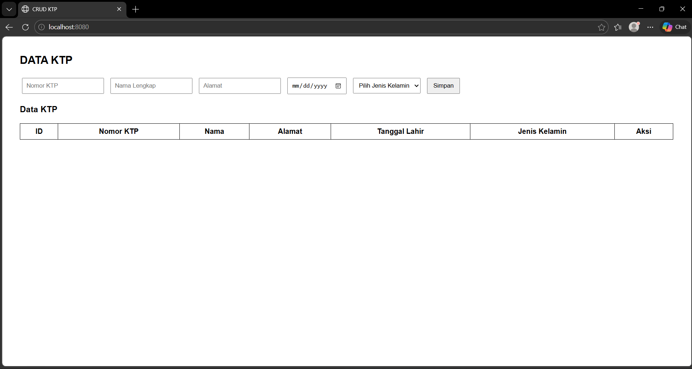
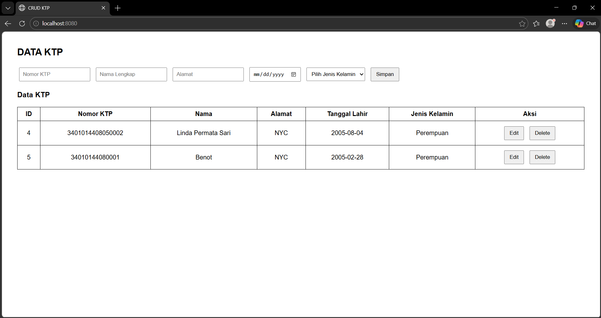
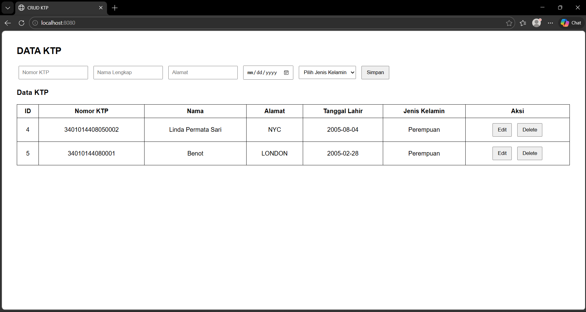
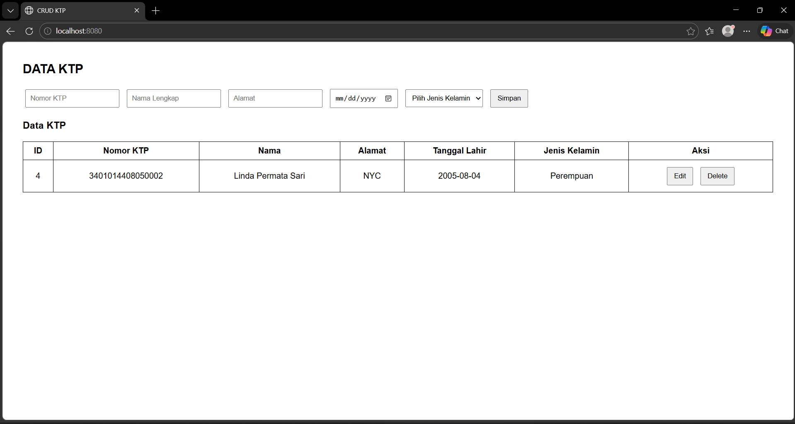

# Laporan Tugas Praktikum: API CRUD KTP
**Nama:** Linda Permata Sari  
**NIM:** 20230140086  
**Prodi:** Teknologi Informasi - Universitas Muhammadiyah Yogyakarta

---

## 🛠️ API Specification

### 1. Create KTP
**Endpoint:** `POST /api/ktp`  
**Request Body:**
```json
{
  "nomorKtp": "3401014408050002",
  "namaLengkap": "Linda Permata Sari",
  "alamat": "NYC",
  "tanggalLahir": "2005-08-05",
  "jenisKelamin": "Perempuan"
}
```
        
Response Body (success) :
```json
{
  "status": "success",
  "data": {
    "id": 1,
    "nomorKtp": "3401014408050002",
    "namaLengkap": "Linda Permata Sari",
    "alamat": "NYC",
    "tanggalLahir": "2005-08-05",
    "jenisKelamin": "Perempuan"
  }
}
```

##Get All KTP
Endpoint : GET /api/ktp

Response Body (success):
```json
{
  "status": "success",
  "data": [
    {
      "id": 1,
      "nomorKtp": "3401014408050002",
      "namaLengkap": "Linda Permata Sari",
      "alamat": "NYC",
      "tanggalLahir": "2005-08-05",
      "jenisKelamin": "Perempuan"
    },
    {
      "id": 2,
      "nomorKtp": "3401014408050001",
      "namaLengkap": "Benot",
      "alamat": "NYC",
      "tanggalLahir": "2005-02-28",
      "jenisKelamin": "Perempuan"
    }
  ]
}
```

##Get KTP by ID
Endpoint : GET /api/ktp/{id}

Response Body (success):
```json
{
  "status": "success",
  "data": {
    "nomorKtp": "3401014408050002",
    "namaLengkap": "Linda Permata Sari",
    "alamat": "NYC",
    "tanggalLahir": "2005-08-05",
    "jenisKelamin": "Perempuan"
  }
}
```

##Update KTP
Endpoint : PUT /api/ktp/{id}

Response Body:
```json
{
  "nomorKtp": "3401014408050001",
  "namaLengkap": "Benot",
  "alamat": "LONDON",
  "tanggalLahir": "2005-02-28",
  "jenisKelamin": "Perempuan"
}
```

Response Body (success):
```json
{
  "status": "success",
  "data": {
    "nomorKtp": "3401014408050001",
    "namaLengkap": "Benot",
    "alamat": "LONDON",
    "tanggalLahir": "2005-02-28",
    "jenisKelamin": "Perempuan"
  },
  "status": "success"
}
```

##Delete KTP
Endpoint : DELETE /api/ktp/{id}

```json
{
  "status": "success",
  "message": "success delete ktp with id 2"
}
```

Response Body (failed) :
```json
{
  "status": "failed",
  "message": "KTP tidak ditemukan"
}
```

##Tampilan Web

Halaman Home


Tambah Data


Edit Data


Hapus Data

